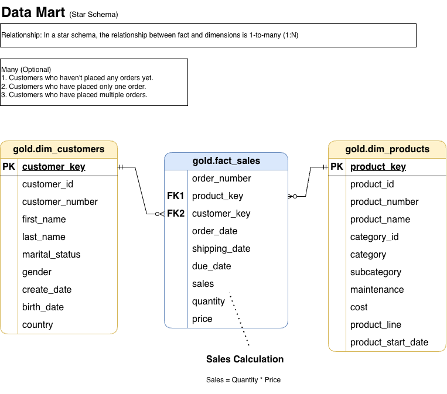

# SQL Server Data Warehouse & Analytics Project

An end-to-end data warehousing project that integrates CRM and ERP data into a structured analytical model using **SQL Server and T-SQL**.

The project implements a **Bronze → Silver → Gold** architecture covering raw data ingestion, data cleansing and transformation, source integration, dimensional modelling, and data-quality validation.

> **Project context:** This repository was developed as a guided learning project while studying data warehousing and SQL. I implemented and ran the solution locally using SQL Server in Docker on macOS, working through ETL, data-quality, integration, and dimensional-modelling concepts. I am continuing to extend the project with additional analytics and data-engineering features.

---

## Architecture


The warehouse follows a three-layer architecture:

### Bronze Layer — Raw Ingestion

The Bronze layer preserves source data in its original structure.

- Loads CRM and ERP data from CSV files.
- Uses SQL Server `BULK INSERT`.
- Performs full-refresh loading using `TRUNCATE`.
- Records individual table and batch load durations.
- Uses `TRY...CATCH` for load error handling.

### Silver Layer — Cleaning & Transformation

The Silver layer transforms the raw data into cleaned and standardised datasets.

Transformations include:

- Removing duplicate customer records with `ROW_NUMBER()`.
- Trimming and standardising text values.
- Normalising gender, marital status, country, and product-line values.
- Handling invalid and missing dates.
- Correcting missing or inconsistent sales and price values.
- Extracting category and product identifiers from source keys.
- Removing inconsistent identifier formats.
- Deriving product end dates using the `LEAD()` window function.
- Integrating data originating from CRM and ERP systems.

### Gold Layer — Business-Ready Model

The Gold layer exposes analytical views organised into a star-schema-style model:

- `gold.dim_customers`
- `gold.dim_products`
- `gold.fact_sales`

The dimensions combine and enrich information from multiple source systems, while the sales fact provides transactional measures linked through customer and product surrogate keys.

---

## Data Flow


```text
CRM CSV Files ──┐
                ├──► Bronze ──► Silver ──► Gold ──► Analytics / Reporting
ERP CSV Files ──┘
```

## Data Layers

**Bronze** stores raw source data.

**Silver** cleans, standardises, validates, and integrates the data.

**Gold** provides business-ready dimensions and facts for analytical queries and reporting.

---

## Dimensional Model



The Gold layer follows a dimensional modelling approach centred around sales.

### `gold.dim_customers`

Contains customer attributes enriched using CRM and ERP information, including:

- Customer identity
- Name
- Gender
- Marital status
- Birth date
- Country

### `gold.dim_products`

Contains current product information including:

- Product identity
- Product name
- Category
- Subcategory
- Product line
- Cost
- Maintenance information

### `gold.fact_sales`

Contains sales transactions and connects customers and products through surrogate keys.

Measures and attributes include:

- Sales amount
- Quantity
- Unit price
- Order date
- Shipping date
- Due date

For complete Gold-layer definitions, see the [Data Dictionary](docs/data_catalog.md).

---

## Data Quality & Validation

Data quality checks are included for both the Silver and Gold layers.

### Silver Layer Checks

The Silver validation process checks cleaned and transformed data for issues such as:

- Duplicate or invalid identifiers
- Unwanted spaces
- Inconsistent categorical values
- Invalid dates
- Missing values
- Invalid sales and pricing relationships

### Gold Layer Checks

The Gold validation process checks:

- Uniqueness of customer surrogate keys
- Uniqueness of product surrogate keys
- Relationships between fact and dimension views
- Data-model connectivity

Validation scripts are available in the [`tests/`](tests/) directory.

---

## Repository Structure

```text
sql-datawarehouse-project/
│
├── docs/
│   ├── architecture.drawio
│   ├── architecture.drawio.png
│   ├── data_flow_diagram.drawio
│   ├── data_flow_diagram.drawio.png
│   ├── data_model.drawio
│   ├── data_model.drawio.png
│   ├── integration_model.drawio
│   ├── integration_model.drawio.png
│   ├── data_catalog.md
│   └── naming_conventions.md
│
├── scripts/
│   ├── bronze/
│   │   ├── ddl_bronze.sql
│   │   └── proc_load_bronze.sql
│   │
│   ├── silver/
│   │   ├── ddl_silver.sql
│   │   └── proc_load_silver.sql
│   │
│   ├── gold/
│   │   └── ddl_gold.sql
│   │
│   └── init_database.sql
│
├── tests/
│   ├── quality_checks_silver.sql
│   └── quality_checks_gold.sql
│
├── datasets/
├── README.md
└── LICENSE.md
```

---

## Technologies & Concepts

### Technologies

- SQL Server
- T-SQL
- Docker
- CSV source files
- Draw.io

### Data Engineering

- ETL
- Data Warehousing
- Bronze / Silver / Gold Architecture
- Data Cleansing
- Data Transformation
- Data Integration
- Data Quality Validation
- Dimensional Modelling
- Star Schema

### SQL

- Stored Procedures
- Views
- Window Functions
- `ROW_NUMBER()`
- `LEAD()`
- `BULK INSERT`
- `CASE`
- `COALESCE`
- `ISNULL`
- `NULLIF`
- String transformations
- Joins
- Error handling with `TRY...CATCH`

---

## ETL Workflow

The pipeline follows three main stages:

```sql
-- 1. Load source CSV files into the Bronze layer
EXEC bronze.load_bronze;

-- 2. Clean and transform Bronze data into the Silver layer
EXEC silver.load_silver;

-- 3. Create the Gold analytical views
-- Run:
-- scripts/gold/ddl_gold.sql
```

The pipeline currently uses a full-refresh loading strategy for the Bronze and Silver layers.

---

## Business Use Cases

The resulting warehouse provides structured data that can support analysis of:

- Sales trends
- Customer behaviour
- Product performance
- Customer demographics
- Geographic sales patterns
- Product categories and subcategories

The Gold layer acts as the reporting-facing layer for SQL analysis and can serve as a source for BI tools.

---

## What I Learned

This project helped me develop a practical understanding of how data moves through a warehouse from raw source files to a business-ready analytical model.

Key areas of learning included:

- Designing a layered data warehouse architecture
- Building ETL workflows with T-SQL stored procedures
- Cleaning and standardising inconsistent source data
- Using SQL window functions for deduplication and data transformation
- Integrating data from multiple source systems
- Designing fact and dimension structures
- Implementing data-quality checks between transformation stages
- Running SQL Server in Docker on macOS

---

## Future Improvements

I plan to extend this project beyond the initial warehouse implementation with:

- Power BI reporting connected to the Gold layer
- DAX measures and analytical KPIs
- ETL audit and logging tables
- Improved automated data-quality checks
- Incremental loading
- Pipeline orchestration
- Additional analytical SQL

These extensions will build on the existing warehouse rather than replace the current architecture.

---

## Documentation

Additional project documentation is available in the [`docs/`](docs/) directory:

- [Data Dictionary](docs/data_catalog.md)
- [Naming Conventions](docs/naming_conventions.md)
- [Architecture Diagram](docs/architecture.drawio.png)
- [Data Flow Diagram](docs/data_flow_diagram.drawio.png)
- [Integration Model](docs/integration_model.drawio.png)
- [Dimensional Data Model](docs/data_model.drawio.png)

---

## Acknowledgements

This project was developed as a hands-on learning project based on the **Data Warehouse with SQL Server** tutorial by **Data with Baraa** on YouTube.

I followed the guided project to strengthen my understanding of data warehousing, ETL processes, data cleansing, dimensional modelling, and analytical SQL. I implemented and ran the project in my own local environment using **SQL Server in Docker on macOS**, while troubleshooting the setup, data-loading, and development workflow along the way.

The repository also serves as a foundation for my continued independent development, including planned extensions in **Power BI, DAX, ETL auditing, data-quality automation, and incremental loading**.

### Learning Resource

- YouTube Channel: [Data with Baraa](https://www.youtube.com/@DataWithBaraa)

## Author

**Nischal Shakya**

Software Engineer expanding into Data Engineering & Analytics.

- GitHub: [shakya-nischal](https://github.com/shakya-nischal)
- LinkedIn: [Nischal Shakya](https://www.linkedin.com/in/nischal-shakya-79860a178/)
- Portfolio: [nischal-shakya.vercel.app](https://nischal-shakya.vercel.app/)
