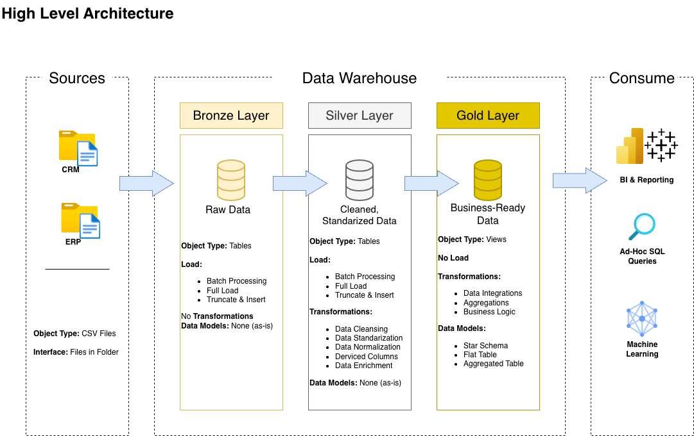
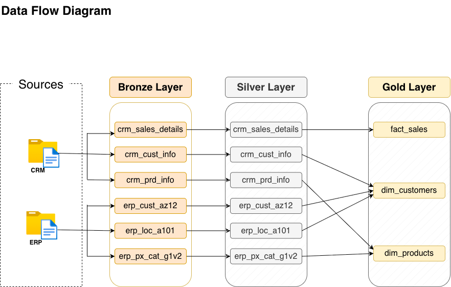

# SQL Server Data Warehouse & Analytics Project

An end-to-end data warehousing project that integrates CRM and ERP data into a structured analytical model using **SQL Server and T-SQL**.

The project implements a **Bronze → Silver → Gold** architecture covering raw data ingestion, data cleansing and transformation, source integration, dimensional modelling, and data-quality validation.

> **Project context:** This repository was developed as a guided learning project while studying data warehousing and SQL. I implemented and ran the solution locally using SQL Server in Docker on macOS, working through ETL, data-quality, integration, and dimensional-modelling concepts. I am continuing to extend the project with additional analytics and data-engineering features.

---

## Architecture



The warehouse follows a three-layer architecture:

### Bronze Layer — Raw Ingestion

The Bronze layer preserves source data in its original structure.

- Loads CRM and ERP data from CSV files.
- Uses SQL Server `BULK INSERT`.
- Performs full-refresh loading using `TRUNCATE`.
- Records individual table and batch load durations.
- Uses `TRY...CATCH` for load error handling.

### Silver Layer — Cleaning & Transformation

The Silver layer transforms the raw data into cleaned and standardised datasets.

Transformations include:

- Removing duplicate customer records with `ROW_NUMBER()`.
- Trimming and standardising text values.
- Normalising gender, marital status, country, and product-line values.
- Handling invalid and missing dates.
- Correcting missing or inconsistent sales and price values.
- Extracting category and product identifiers from source keys.
- Removing inconsistent identifier formats.
- Deriving product end dates using the `LEAD()` window function.
- Integrating data originating from CRM and ERP systems.

### Gold Layer — Business-Ready Model

The Gold layer exposes analytical views organised into a star-schema-style model:

- `gold.dim_customers`
- `gold.dim_products`
- `gold.fact_sales`

The dimensions combine and enrich information from multiple source systems, while the sales fact provides transactional measures linked through customer and product surrogate keys.

---

## Data Flow



```text
CRM CSV Files ──┐
                ├──► Bronze ──► Silver ──► Gold ──► Analytics / Reporting
ERP CSV Files ──┘
